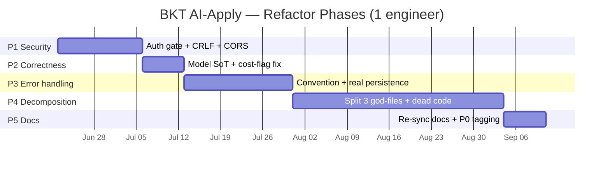

# Modernization Brief — BKT AI-Apply

| | |
|---|---|
| **System** | `bkt-ai-apply` (`C:\Users\johnb\bkt-ai-apply`) |
| **Brief date** | 2026-06-15 |
| **Recommended target stack** | **Same stack, hardened** — React 19 + Vite + TypeScript (strict) SPA · Supabase (PostgreSQL+RLS, Auth, Realtime, Storage, Deno Edge Functions) · Vercel. *No re-platform.* |
| **Modernization pattern** | **Refactor in place** (per ASSESSMENT.md §9) |
| **Built from** | `ASSESSMENT.md` (2026-06-15 14:29) · `topology.json` (14:39) · `BUSINESS_RULES.md` (14:53) · `DATA_OBJECTS.md` (14:53) · `ARCHITECTURE.mmd` (14:27) |
| **Inputs status** | First generation; all inputs same-day and consistent — no staleness conflict |

---

## 1. Objective

Move BKT AI-Apply **from a modern-but-uneven codebase to a hardened, trustworthy one — without changing its stack**. The system is already cloud-native, well-tested (~37 test files), and deeply documented; it does **not** need a rehost, replatform, or rebuild. What it needs, now, is a bounded refactor that closes a small number of concrete, verified risks before the auto-submission feature goes live: two server endpoints that are publicly invokable with no authentication, a silent model-substitution bug that makes every AI call run a different model than is logged and priced, an error-handling pattern that masks real failures as fake "demo" data, and three god-files that concentrate all future change-risk. Doing this now — while the test suite and institutional knowledge are intact and before real applications are sent on a user's behalf — is far cheaper than doing it after an incident.

---

## 2. Target Architecture

The end state is the **current architecture with four hardening changes** (marked **★ NEW/CHANGED**): a shared Edge-Function auth gate, an explicit error-handling layer, decomposed presentation components, and a single source of truth for AI model identity. Full domain dependency graph: `ARCHITECTURE.mmd`.

```mermaid
C4Container
    title Target Architecture — BKT AI-Apply (hardened; same stack)
    Person(seeker, "Job Seeker (operator)", "Single operator today; multi-tenant is an open question")

    System_Boundary(client, "Browser") {
        Container(spa, "React 19 SPA", "Vite, TS strict, Tailwind v4", "11 feature domains; anon key only; god-files decomposed ★")
    }
    System_Boundary(supabase, "Supabase Platform") {
        ContainerDb(db, "PostgreSQL + RLS", "Postgres", "26 tables, event-sourced application_events, guardrail RPCs")
        Container(auth, "Auth (GoTrue)", "OAuth + email", "Open signup disabled for single-tenant ★")
        Container(edge, "Edge Functions", "Deno", "9 functions: prospector-cron, gmail-sync/-send, ai-chat, score-job-fit, generate-document, format-jd, submission-worker, provider-status")
        Container(gate, "_shared auth gate ★ NEW", "Deno", "Unified CRON_SECRET/JWT verification; fail-closed; shared createServiceClient + CORS allow-list")
    }
    System_Ext(serp, "SerpAPI", "Google Jobs discovery")
    System_Ext(gmail, "Gmail / Google OAuth", "Email ingest + send")
    System_Ext(llm, "LLM providers", "Anthropic / OpenAI / Gemini")
    System_Ext(ats, "ATS APIs + Browserbase", "Greenhouse / Lever / Ashby / browser fallback")

    Rel(seeker, spa, "Uses")
    Rel(spa, edge, "invoke (JWT)", "HTTPS")
    Rel(spa, db, "read/write (RLS, anon key)", "supabase-js")
    Rel(edge, gate, "verifies every request ★")
    Rel(edge, db, "service-role (RLS bypass)")
    Rel(edge, serp, "fetch jobs")
    Rel(edge, gmail, "sync / send")
    Rel(edge, llm, "route by task type")
    Rel(edge, ats, "submit (gated by SUBMISSION_LIVE)")
```

**Legacy → target mapping** (every domain maps to itself, refactored — this is the proof that no re-platform is required):

| Today (domain) | Target | Change in this program |
|---|---|---|
| App Shell & Auth | Same | Disable open signup for single-tenant (or formalize multi-tenant — open Q1) |
| AI Routing & Scoring | Same | **Single source of truth for model identity** (fix `anthropic.ts` id map ★); cost-cap critical-task flag corrected |
| Gmail Integration | Same | **Auth gate on `gmail-sync` ★**; CRLF/header-injection fix in `gmail-send` |
| Job Discovery & Prospector | Same | **Auth gate on `prospector-cron` ★**; decompose the 1112-LOC god-function; de-duplicate the two upsert loops |
| Auto-Submission Engine | Same | Move self-writable guardrails behind service-role; keep kill-default + CRON_SECRET design |
| Applications Pipeline & Events | Same | Unchanged core (event sourcing is correct) — used as the characterization-test anchor |
| Auto-Apply Workspace & Settings | Same | **Real persistence for PreferencesScreen ★**; decompose 1029-LOC screen; remove hardcoded PII |
| Documents / Conversational AI / Settings | Same | Remove dead second chat stack; extract shared formatters; error-handling convention |
| Data Schema & RLS Migrations | Same | Column-scoped RLS / SECURITY DEFINER for credit & budget fields; prune dead actor enum |
| Shared infra (`_shared/*`) | Same + **auth gate ★** | Extract `createServiceClient()`; centralize CORS; unify Deno typing |
| `*.test.ts` (37 suites) + Playwright | Same | **Promoted to the regression safety net** — pinned before each phase |

---

## 3. Phased Sequence

Strangler-fig ordering for a refactor = **isolated + urgent first, broad + risky last**. Each phase lands on top of the previous one so the big decomposition (Phase 4) refactors *already-correct* behavior. Effort is in person-months (PM), same unit as the assessment's COCOMO figure; assumes one engineer.



### Phase 1 — Security hardening  ·  ~0.5–1.0 PM  ·  Risk: **Medium**
- **Scope:** `prospector-cron`, `gmail-sync` (RULE-025, RULE-031), `gmail-send/mime.ts` (CRLF), `_shared/http.ts` (CORS). Generalize `submission-worker`'s `isCronAuthorized()` into a shared `_shared` gate (altitude: fix the mechanism, not each call site).
- **Entry criteria:** `pnpm validate` green on `main`; CRON_SECRET provisioned in the Supabase project.
- **Exit criteria:** unauthenticated POST to `prospector-cron`/`gmail-sync` returns 401; a CRLF unit test on `mime.ts` rejects `\r`/`\n`; CORS echoes only allow-listed origins; full Vitest + Playwright suite green.
- **Top risks:** (1) breaking the legitimate scheduler/client refresh button → *mitigation:* accept both a CRON_SECRET header and a verified JWT, test both paths. (2) Lock-out of pg_cron → *mitigation:* set the secret in `net.http_post` headers before deploy; stage in dry-run.

### Phase 2 — Correctness & model single-source-of-truth  ·  ~0.25–0.5 PM  ·  Risk: **Medium**
- **Scope:** `_shared/llm/anthropic.ts` model-id map (RULE-062); cost-cap `isCritical` flag (RULE-001 defect); pricing/name alignment across `ai-router.ts`, `model-routing.md`, BR-103.
- **Entry criteria:** **Open Q2 resolved** — the org decides whether the intended model is `claude-opus-4-6` or `claude-opus-4-8`.
- **Exit criteria:** a unit test asserts every `CHAT_MODEL_CATALOG`/`ROUTING_MATRIX` display name resolves to an API id of the matching version; a dual-run diff on `score-job-fit` + `generate-document` shows logged `model_name` == executed model.
- **Top risks:** (1) output drift if the "intended" model differs from today's silent one → *mitigation:* parallel-run diff on a fixed JD set before/after. (2) cost-cap regression → *mitigation:* re-derive the 80/90/100% ladder against the corrected price.

### Phase 3 — Error-handling discipline & real persistence  ·  ~1.0–1.5 PM  ·  Risk: **Medium**
- **Scope:** author `docs/conventions/error-handling.md`; add an `error` channel to `useAsyncData` + the `DataSource` result; stop the demo-data masking in `autoApplyService.ts` (6 sites); wire `PreferencesScreen` to real persistence (RULE-… preferences) and delete hardcoded PII.
- **Entry criteria:** Phase 2 merged.
- **Exit criteria:** an induced RLS/auth failure surfaces a retry banner (does **not** render demo data); preferences round-trip through Supabase and survive reload; demo data only appears when genuinely unconfigured; tests cover both.
- **Top risks:** (1) UI now shows errors that were previously hidden → *mitigation:* this is the point; ship with a clear retry UX. (2) preferences schema gap → *mitigation:* a profile/preferences table may be needed beyond the existing `user_settings`.

### Phase 4 — God-file decomposition & dead-code removal  ·  ~2.0–3.0 PM  ·  Risk: **High**
- **Scope:** split `ProspectorSearchResults.tsx` (1523 LOC), `prospector-cron/index.ts` (1112 LOC, de-dupe the two upsert loops), `PreferencesScreen.tsx` (1029 LOC); extract shared formatters + `createServiceClient()`; delete confirmed dead code (`calendarIntelligenceService`, `gmailIntelligenceService`, the second chat stack, unused shadcn primitives); prune the dead `application_events.actor` enum values.
- **Entry criteria:** Phases 1–3 merged (decompose corrected, not legacy, behavior).
- **Exit criteria:** each god-file replaced by a thin container + presentational children per `component-patterns.md`; **characterization tests pass byte-for-byte unchanged**; the two prospector upsert loops are a single tested helper; dead modules removed with no broken imports; `pnpm validate` green.
- **Top risks:** (1) behavioral regression in DnD/filter/persistence or the dedup/stats logic → *mitigation:* characterization tests written **first** (this is the largest blast radius — pin behavior before touching). (2) accidentally deleting not-actually-dead code → *mitigation:* the topology dead-end list is verified (imported only by tests); confirm with a full typecheck + e2e before delete.

### Phase 5 — Documentation re-sync  ·  ~0.5 PM  ·  Risk: **Low**
- **Scope:** fix CLAUDE.md dead links + React 18→19; rewrite `architecture.md` to the real (poll-based, no-webhook) Gmail design and actual function list; de-duplicate ADR-001; author the missing convention docs; **add `Priority: P0` tags to the canonical `business-rules.md`** (the de-facto P0 set is the "Core Invariants" section — open Q3).
- **Entry criteria:** Phases 1–4 merged (so docs describe the new reality).
- **Exit criteria:** every CLAUDE.md / architecture.md reference resolves to a real file/function; ADR ids unique; `business-rules.md` carries explicit priorities matching this brief's behavior contract.
- **Top risks:** (1) docs drift again → *mitigation:* the existing `AGENTS.md` "after every task" checklist already mandates doc updates — enforce it in review.

**Program total: ~4.25–6.5 PM** (vs. the ~156 PM COCOMO *greenfield* figure — confirming refactor ≪ rebuild).

---

## 4. Business Walkthroughs

The four persona flows from `topology.json`, in business language, mapped to the modules that implement each today and the phase that touches them. (Persona for all: the **Job Seeker / operator** — there is one operator today.)

| Flow | What happens (business language) | Implemented today by | Phase(s) touching it |
|---|---|---|---|
| **Roles are discovered automatically** | Twice a day the system searches job boards for matches and files new postings for review | `prospector-cron` → SerpAPI → `jobs`/`prospecting_runs`; `format-jd`; `prospectorGraduationService` → `ai_scores`/`applications`; Prospector dashboard | **P1** (auth gate), **P4** (decompose cron + dashboard) |
| **An application is approved and auto-submitted** | The seeker approves a prepared packet; a guarded worker submits it to the employer — but only in live mode | `SubmissionGatePanel` → `submissionApprovalService` → `transition_stage` → `application_events`/`application_queue`; `submission-worker` → `resolveChannel`/`atsAdapters`; `notify` | **P1** (CRON_SECRET), guardrails hardened; behavior **frozen** by P0 contract |
| **An email moves an application forward on its own** | A recruiter email is ingested, classified, and (if confident) advances the stage automatically | `gmail-sync` → `gmail-sync/logic` (Gemini, ≥0.70) → `transition_stage` → `applications`/`application_events`; PipelineBoard (Realtime) | **P1** (auth gate), **P2** (classifier model id) |
| **A tailored resume & cover letter is generated** | From a target job, the seeker generates application documents drafted by the routed LLM | `DocBuilder` → `documentGenerationService` (+ `masterProfile`) → `generate-document` → `_shared/llm/factory`; `textSanitizer` → `documentStorageService` → `documents`/`application_materials` | **P2** (model id), **P3** (error surfacing) |

> SME confirmation: the personas above are inferred as a single operator (JB). If the product is intended for multiple end-users, flows 2 and 3 acquire per-tenant isolation requirements (see Open Q1).

---

## 5. Behavior Contract

These **38 P0 rules** (money / regulatory / data-integrity) MUST be proven equivalent before the phase that touches them ships. They become the regression suite. Full Given/When/Then cards: `BUSINESS_RULES.md`. Grouped by theme (duplicate IDs across extraction lenses point to the same code and collapse here):

- **Money & cost control:** RULE-001 AI $75/mo cap + warning ladder ⚠️ · RULE-005/027 monthly submission budget (1 credit=$1) · RULE-006 credit charge/refund accounting ⚠️ · RULE-022 credit balance gate · RULE-012 per-model pricing.
- **Match scoring (drives autonomy):** RULE-002/050 email-classify ≥0.70 gate · RULE-003 heuristic fallback weights ⚠️ · RULE-004 60/80 recommendation thresholds.
- **Submission safety (real-world side effects):** RULE-019 approval needs linked resume · RULE-020/067 autonomous eligibility (review_mode+score, server-authoritative) · RULE-021 candidate-completeness gate · RULE-023/065 daily cap · RULE-028 no resubmit · RULE-030 pause kill-switch · RULE-032 ownership gate · RULE-033 RPCs service-role-only · RULE-048 `claim_submission` guardrail ladder · RULE-052 finalize success/failure side-effects · RULE-054 stuck-row terminal expiry · RULE-055 queue state machine · RULE-064 approval events server-trusted · RULE-068 SUBMISSION_LIVE kill-default.
- **Auth boundaries:** RULE-024 gmail-send JWT-scoped · RULE-026/066 CRON_SECRET fail-closed ⚠️ · RULE-025 gmail-sync no-auth ⚠️ · RULE-031 prospector-cron no-auth ⚠️.
- **Pipeline integrity (event sourcing):** RULE-046/051/063 application_events append-only + mandatory on every change · RULE-047 atomic stage transition (ownership+optimistic-lock) · RULE-029 offer-stage protection · RULE-053 one-directional transitions (except ghosted→applied) · RULE-049 document immutability after linking.

### Blockers — P0 rules carrying a suspected defect (preserve-vs-fix decision required *before* their phase starts)

The 7 ⚠️ rules are P0 **and** look wrong. The behavior contract cannot say "preserve exactly" for a rule that encodes a bug. Each needs an explicit decision (these are not preserve-as-is):

1. **RULE-062** (model id silent swap) — **fix** in Phase 2 (this is the headline correctness bug).
2. **RULE-025 / RULE-031** (gmail-sync / prospector-cron no auth) — **fix** in Phase 1 (add the gate).
3. **RULE-066** (live worker must have CRON_SECRET) — **preserve & enforce** in Phase 1.
4. **RULE-001** (cost cap: BR-053 claims stage transitions are critical, but only `email_classification` is flagged `isCritical`) — decide whether stage-transition AI calls must be cap-exempt.
5. **RULE-003** (heuristic fallback: a non-matching job scores 5, never 0; `domain` target = 1 match) — confirm the calibration is intended.
6. **RULE-006** (credit charge/refund accounting) — confirm the refund-on-failure path is exactly correct before freezing it.

**Confidence:** every P0 rule is **High** confidence; the single Medium-confidence rule (RULE-074, prospector frequency/isolation) is **P1**, so no P0 rule is blocked on confidence — only on the preserve-vs-fix decisions above.

---

## 6. Validation Strategy

| Phase | Primary validation | Why |
|---|---|---|
| **P1 Security** | **Contract tests** (auth gate: 401 unauth, 200 with secret/JWT) + **characterization** (existing suite green) + targeted **CRLF unit test** | Auth is a binary contract; the rest must be proven unchanged |
| **P2 Correctness** | **Parallel-run / dual-execution diff** on `score-job-fit` + `generate-document` over a fixed JD corpus (before vs after) + a name→id resolution unit test | The fix *changes which model runs* — only a diff proves the change is the intended one and nothing else moved |
| **P3 Error handling** | **Characterization** (induced-failure tests assert error surfaced, not demo data) + **manual UAT** (preferences round-trip, retry banner) | Behavior that was previously hidden needs human eyes on the new UX |
| **P4 Decomposition** | **Characterization tests written first**, must pass byte-for-byte after the split + **property-based** tests on the scoring clamps (RULE-015) and the unified prospector ingest helper + full **e2e** | Pure refactor = identical observable behavior; the safety net must exist before the cut |
| **P5 Docs** | **Link-check** (every referenced path resolves) + review against this brief's contract | Docs have no runtime behavior; correctness = accuracy |

Across all phases the **38 P0 rules** are the non-negotiable equivalence set; the existing ~37 Vitest/Playwright suites are the starting characterization harness and are extended per-phase.

---

## 7. Open Questions

Tick each before Phase 1 starts (or assign an owner). These are human/SME decisions the code cannot answer:

- [x] **Q1 — Tenancy. RESOLVED 2026-06-15: multi-tenant** with per-use-case isolation. Consequence: do **not** disable open signup; instead later phases must add a tenant primitive (`tenant_id`), server-side cost-cap enforcement, per-tenant + global ceilings, and optional BYOK. See `LLM_ROUTING_REVIEW.md §4` — this is now the largest architectural workstream and reshapes Phases 3–5 (the self-writable-guardrails finding becomes a real cross-tenant risk, not a self-limitation).
- [x] **Q2 — Intended Anthropic model. RESOLVED 2026-06-15: `claude-opus-4-8`** (the silently-executed model is the intended one). Phase 2 fix is therefore a **rename** — make the display name/pricing/docs say "Claude Opus 4.8" so logs, pricing, and execution agree (not a behavior change).
- [ ] **Q3 — P0 boundary in `business-rules.md`.** Confirm the de-facto P0 set = the "Core Invariants (Never Violate)" section + the 38 rules in §5, so Phase 5 can tag priorities authoritatively.
- [ ] **Q4 — Preserve-vs-fix on the 7 ⚠️ P0 rules** (§5). Specifically RULE-001 (stage-transition cost exemption), RULE-003 (scoring calibration), RULE-006 (credit refund accounting) — preserve current behavior or correct it during transform?
- [ ] **Q5 — Production telemetry.** Can APM / Edge-Function logs be made available? ASSESSMENT.md §4 had none, so operational-risk ranking and the gantt durations are static estimates, not measured.

---

## 8. Approval Block

```
Approved by: ________________________   Date: ____________

Approval covers:   [ ] Phase 1 only        [ ] Full plan

Conditions / notes: _______________________________________
```

> This brief is the human-in-the-loop control point. Per the modernization workflow, **no transformation work begins until this block is signed.** "No objection" is not approval. After approval, the next pipeline step is `/modernize-transform` for the first in-scope module.
